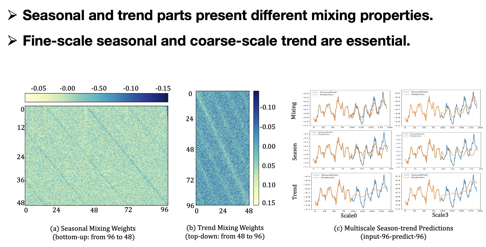
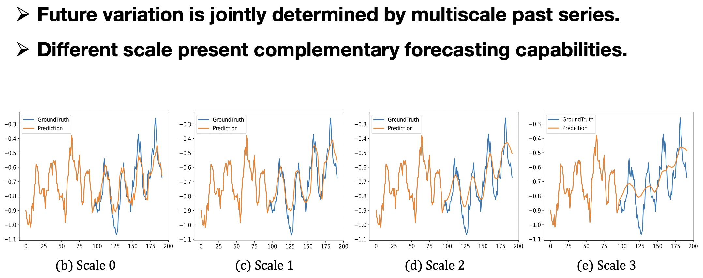
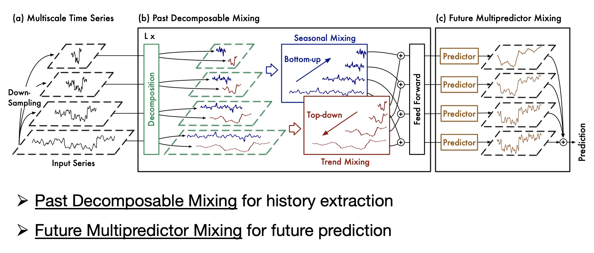
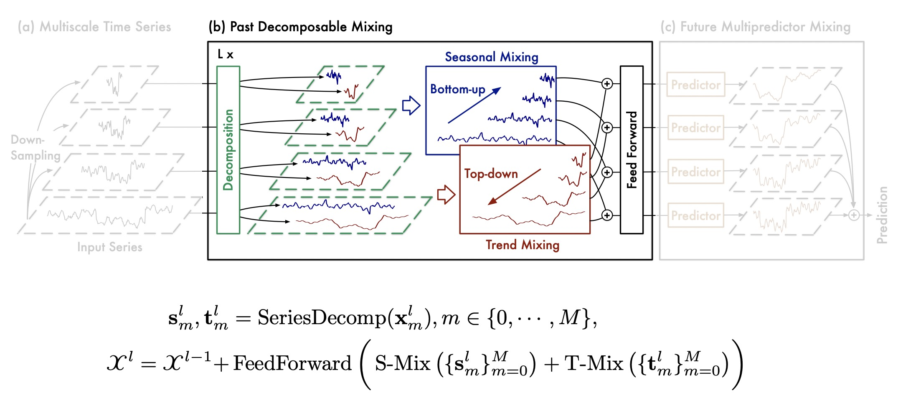
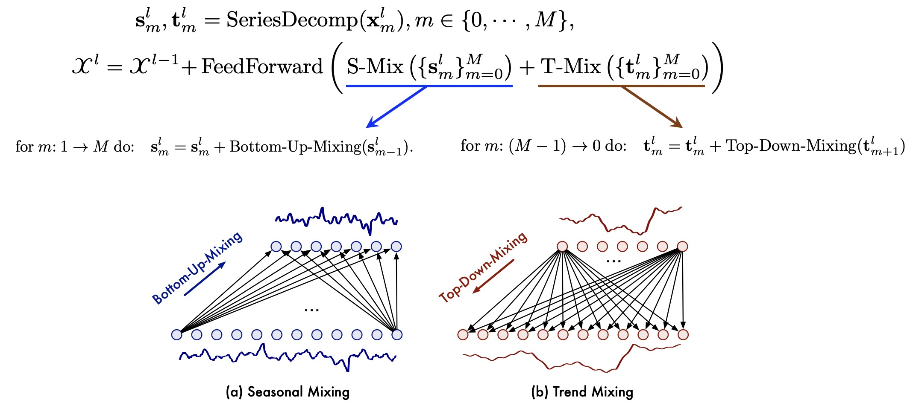
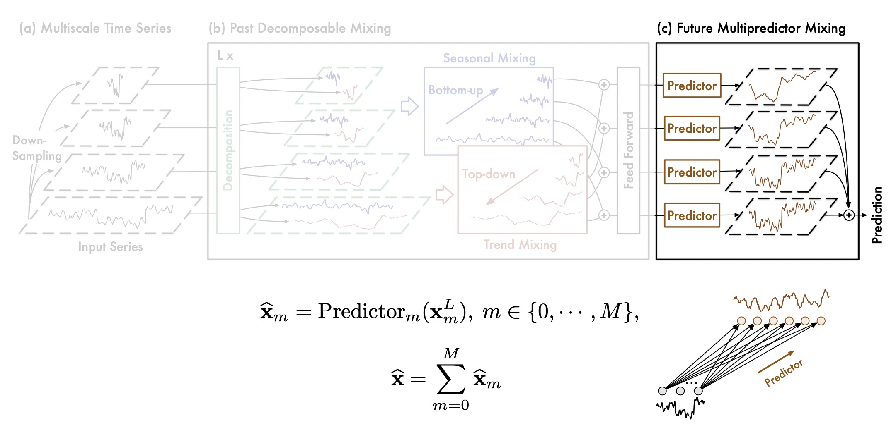
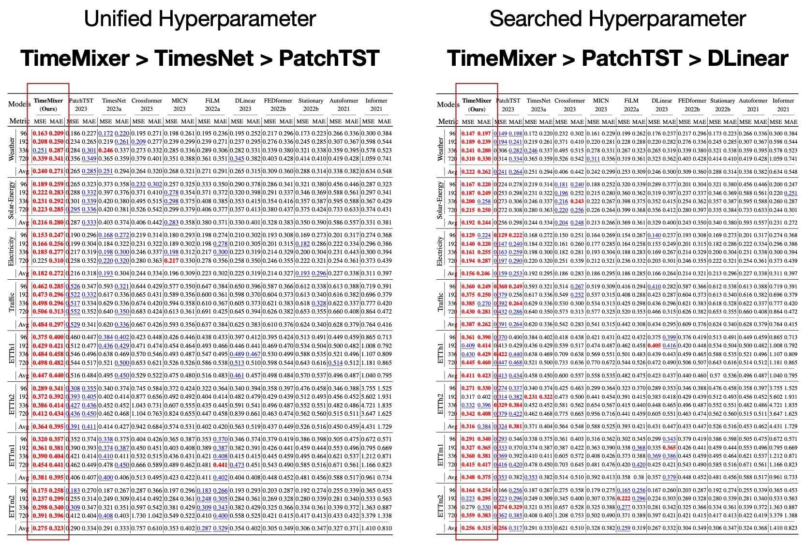
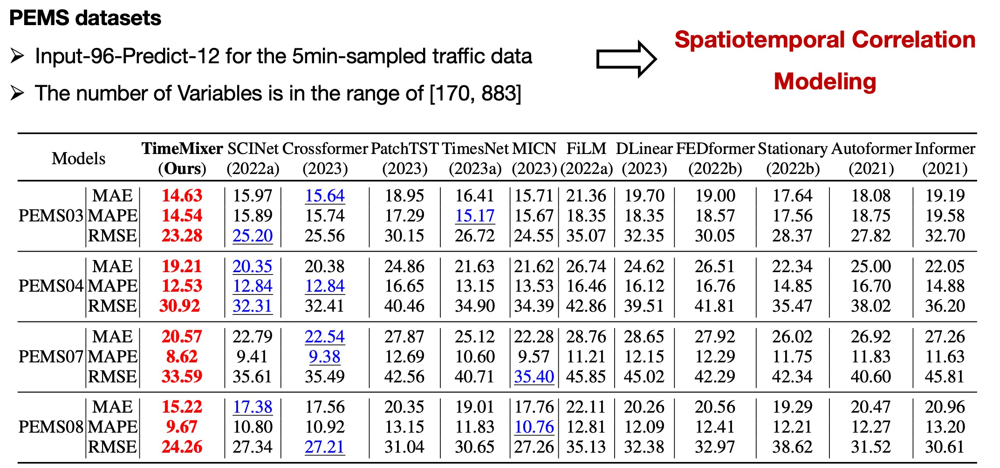
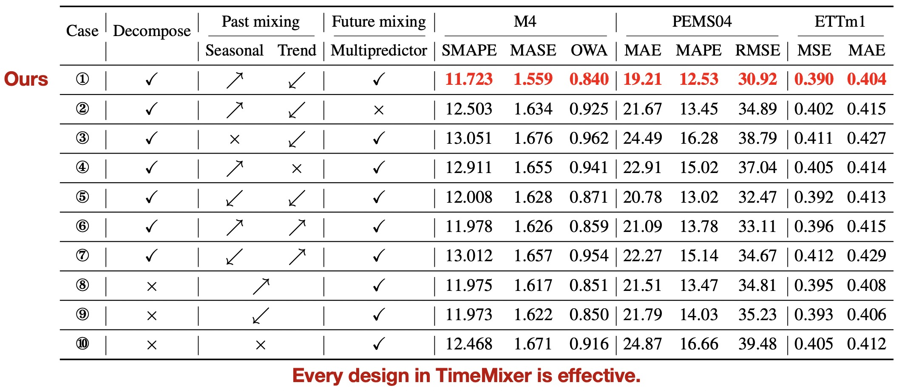
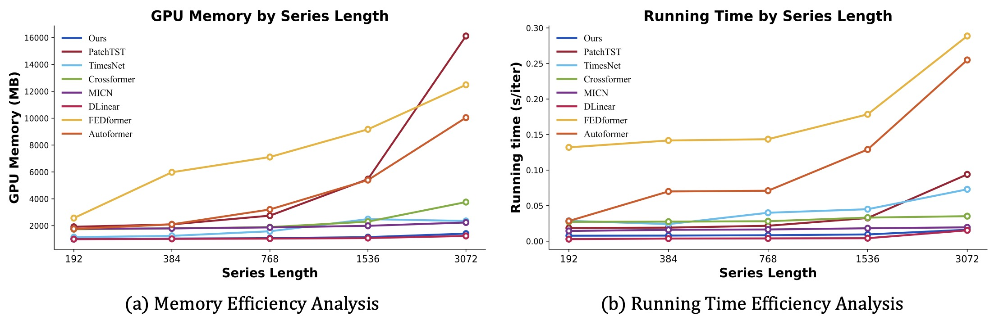

<div align="center">
  <!-- <h1><b> Time-LLM </b></h1> -->
  <!-- <h2><b> Time-LLM </b></h2> -->
  <h2><b> (ICLR'24) TimeMixer: Decomposable Multiscale Mixing for Time Series Forecasting </b></h2>
</div>


<div align="center">


</div>

<div align="center">

**[<a href="https://openreview.net/pdf?id=7oLshfEIC2">Paper Page</a>]**
**[<a href="https://iclr.cc/virtual/2024/poster/19347">ICLR Video</a>]**
**[<a href="https://medium.com/towards-data-science/timemixer-exploring-the-latest-model-in-time-series-forecasting-056d9c883f46">Medium Blog</a>]**

**[<a href="https://mp.weixin.qq.com/s/d7fEnEpnyW5T8BN08XRi7g">中文解读1</a>]**
**[<a href="https://mp.weixin.qq.com/s/MsJmWfXuqh_pTYlwve6O3Q">中文解读2</a>]**
**[<a href="https://zhuanlan.zhihu.com/p/686772622">中文解读3</a>]**
**[<a href="https://mp.weixin.qq.com/s/YZ7L1hImIt-jbRT2tizyQw">中文解读4</a>]**

</div>

🌟🌟🌟Our latest research: "**TimeMixer++: A General Time Series Pattern Machine for Universal Predictive Analysis**", in arXiv 2024. [\[paper\]](https://arxiv.org/abs/2410.16032)

```
@article{wang2024timemixer++,
  title={TimeMixer++: A General Time Series Pattern Machine for Universal Predictive Analysis},
  author={Wang, Shiyu and Li, Jiawei and Shi, Xiaoming and Ye, Zhou and Mo, Baichuan and Lin, Wenze and Ju, Shengtong and Chu, Zhixuan and Jin, Ming},
  journal={arXiv preprint arXiv:2410.16032},
  year={2024}
}
```

---
>
> 🙋 Please let us know if you find out a mistake or have any suggestions!
> 
> 🌟 If you find this resource helpful, please consider to star this repository and cite our research:

```
@inproceedings{wang2023timemixer,
  title={TimeMixer: Decomposable Multiscale Mixing for Time Series Forecasting},
  author={Wang, Shiyu and Wu, Haixu and Shi, Xiaoming and Hu, Tengge and Luo, Huakun and Ma, Lintao and Zhang, James Y and ZHOU, JUN},
  booktitle={International Conference on Learning Representations (ICLR)},
  year={2024}
}
```

# Updates

🚩 **News** (2024.10): **TimeMixer++** introduction in **[Chinese](https://mp.weixin.qq.com/s/l_MB11XoShV7vK3BjtEPog)** is now available！

🚩 **News** (2024.10): We have newly released **[TimerMixer++](https://arxiv.org/abs/2410.16032)** as an upgraded version of TimeMixer. **TimeMixer++ is a time series pattern machine** that employs multi-scale and multi-resolution pattern extraction to **achieve 🏆state-of-the-art across 8 diverse analytical tasks!** 

🚩 **News** (2024.07): TimeMixer has been included in **[NeuralForecast](https://github.com/Nixtla/neuralforecast)**. Special thanks to the contributor @[marcopeix](https://github.com/marcopeix) and @[JQGoh](https://github.com/JQGoh)!

🚩 **News** (2024.07) TimeMixer has evolved into a **large model supporting comprehensive time series analysis, including long-term forecasting, short-term forecasting, anomaly detection, imputation, and classification**. In the future, we will further explore additional types of time series analysis tasks and strive to break through the limitations of current long-term forecasting to achieve efficient extreme-long-term time series forecasting.

🚩 **News** (2024.06) **Introduction of TimeMixer** in **[Chinese](https://mp.weixin.qq.com/s/d7fEnEpnyW5T8BN08XRi7g)** is available.

🚩 **News** (2024.05) TimeMixer has now released a **28-page full paper version on [arXiv](https://arxiv.org/abs/2405.14616)**. Furthermore, we have provided a **brief [video](https://iclr.cc/virtual/2024/poster/19347)** to facilitate your understanding of our work.

🚩 **News** (2024.05) TimeMixer currently **supports using future temporal features for prediction**. This feature has been well-received by the community members. You can now decide whether to enable this feature by using the parameter use_future_temporal_feature.

🚩 **News** (2024.03) TimeMixer has been included in [[Time-Series-Library]](https://github.com/thuml/Time-Series-Library) and achieve the consistent 🏆**state-of-the-art** in **long-term time and short-term series** forecasting.

🚩 **News** (2024.03) TimeMixer has added a time-series decomposition method based on DFT, as well as downsampling operation based on 1D convolution.

🚩 **News** (2024.02) TimeMixer has been accepted as **ICLR 2024 Poster**.

## Introduction
🏆 **TimeMixer**, as a fully MLP-based architecture, taking full advantage of disentangled multiscale time series, is proposed to **achieve consistent SOTA performances in both long and short-term forecasting tasks with favorable run-time efficiency**.

🌟**Observation 1: History Extraction** 

Given that seasonal and trend components exhibit significantly different characteristics in time series, and different scales of the time series reflect different properties, with seasonal characteristics being more pronounced at a fine-grained micro scale and trend characteristics being more pronounced at a coarse macro scale, it is therefore necessary to decouple seasonal and trend components at different scales.

<p align="center">

</p>

🌟**Observation 2: Future Prediction** 

Integrating forecasts from different scales to obtain the final prediction results, different scales exhibit complementary predictive capabilities.

<p align="center">

</p>

## Overall Architecture
TimeMixer as a fully MLP-based architecture with **Past-Decomposable-Mixing (PDM)** and **Future-Multipredictor-Mixing (FMM)** blocks to take full advantage of disentangled multiscale series in both past extraction and future prediction phases. 

<p align="center">

</p>

### Past Decomposable Mixing 
we propose the **Past-Decomposable-Mixing (PDM)** block to mix the decomposed seasonal and trend components in multiple scales separately. 

<p align="center">

</p>

Empowered by seasonal and trend mixing, PDM progressively aggregates the detailed seasonal information from fine to coarse and dive into the macroscopic trend information with prior knowledge from coarser scales, eventually achieving the multiscale mixing in past information extraction.

<p align="center">

</p>

### Future Multipredictor Mixing 
Note that **Future Multipredictor Mixing (FMM)** is an ensemble of multiple predictors, where different predictors are based on past information from different scales, enabling FMM to integrate complementary forecasting capabilities of mixed multiscale series.

<p align="center">

</p>


## Get Started

1. Install requirements. ```pip install -r requirements.txt```
2. Download data. You can download the all datasets from [Google Driver](https://drive.google.com/u/0/uc?id=1NF7VEefXCmXuWNbnNe858WvQAkJ_7wuP&export=download), [Baidu Driver](https://pan.baidu.com/share/init?surl=r3KhGd0Q9PJIUZdfEYoymg&pwd=i9iy) or [Kaggle Datasets](https://www.kaggle.com/datasets/wentixiaogege/time-series-dataset). **All the datasets are well pre-processed** and can be used easily.
3. Train the model. We provide the experiment scripts of all benchmarks under the folder `./scripts`. You can reproduce the experiment results by:

```bash
bash ./scripts/long_term_forecast/ETT_script/TimeMixer_ETTm1.sh
bash ./scripts/long_term_forecast/ECL_script/TimeMixer.sh
bash ./scripts/long_term_forecast/Traffic_script/TimeMixer.sh
bash ./scripts/long_term_forecast/Solar_script/TimeMixer.sh
bash ./scripts/long_term_forecast/Weather_script/TimeMixer.sh
bash ./scripts/short_term_forecast/M4/TimeMixer.sh
bash ./scripts/short_term_forecast/PEMS/TimeMixer.sh
```

## Main Results
We conduct extensive experiments to evaluate the performance and efficiency of TimeMixer, covering long-term and short-term forecasting, including 18 real-world benchmarks and 15 baselines.
**🏆 TimeMixer achieves consistent state-of-the-art performance in all benchmarks**, covering a large variety of series with different frequencies, variate numbers and real-world scenarios.

### Long-term Forecasting

To ensure model comparison fairness, experiments were performed with standardized parameters, aligning input lengths, batch sizes, and training epochs. Additionally, given that results in various studies often stem from hyperparameter optimization, we include outcomes from comprehensive parameter searches.

<p align="center">

</p>

### Short-term Forecasting: Multivariate data

<p align="center">

</p>

###  Short-term Forecasting: Univariate data

<p align="center">

</p>


## Model Abalations

To verify the effectiveness of each component of TimeMixer, we provide detailed ablation study on every possible design in both Past-Decomposable-Mixing and Future-Multipredictor-Mixing blocks on all 18 experiment benchmarks （see our paper for full results 😊）.

<p align="center">

</p>

## Model Efficiency
We compare the running memory and time against the latest state-of-the-art models under the training phase, where TimeMixer consistently demonstrates favorable efficiency, in terms of both GPU memory and running time, for various series lengths (ranging from 192 to 3072), in addition to the consistent state-of-the-art perfor- mances for both long-term and short-term forecasting tasks.
**It is noteworthy that TimeMixer, as a deep model, demonstrates results close to those of full-linear models in terms of efficiency. This makes TimeMixer promising in a wide range of scenarios that require high model efficiency.**

<p align="center">

</p>

## Further Reading
1, [**TimeMixer++: A General Time Series Pattern Machine for Universal Predictive Analysis**](https://arxiv.org/abs/2410.16032), in *arXiv* 2024.

**Authors**: Shiyu Wang*, Jiawei Li*, Xiaoming Shi, Zhou Ye, Baichuan Mo, Wenze Lin, Shengtong Ju, Zhixuan Chu, Ming Jin

```bibtex
@article{wang2024timemixer++,
  title={TimeMixer++: A General Time Series Pattern Machine for Universal Predictive Analysis},
  author={Wang, Shiyu and Li, Jiawei and Shi, Xiaoming and Ye, Zhou and Mo, Baichuan and Lin, Wenze and Ju, Shengtong and Chu, Zhixuan and Jin, Ming},
  journal={arXiv preprint arXiv:2410.16032},
  year={2024}
}
```

2, [**Time-LLM: Time Series Forecasting by Reprogramming Large Language Models**](https://arxiv.org/abs/2310.01728), in *ICLR* 2024.
[\[GitHub Repo\]](https://github.com/KimMeen/Time-LLM)

**Authors**: Ming Jin*, Shiyu Wang*, Lintao Ma, Zhixuan Chu, James Y. Zhang, Xiaoming Shi, Pin-Yu Chen, Yuxuan Liang, Yuan-Fang Li, Shirui Pan, Qingsong Wen

```bibtex
@inproceedings{jin2023time,
  title={{Time-LLM}: Time series forecasting by reprogramming large language models},
  author={Jin, Ming and Wang, Shiyu and Ma, Lintao and Chu, Zhixuan and Zhang, James Y and Shi, Xiaoming and Chen, Pin-Yu and Liang, Yuxuan and Li, Yuan-Fang and Pan, Shirui and Wen, Qingsong},
  booktitle={International Conference on Learning Representations (ICLR)},
  year={2024}
}
```

3, [**iTransformer: Inverted Transformers Are Effective for Time Series Forecasting**](https://arxiv.org/abs/2310.06625), in *ICLR* 2024 Spotlight.
[\[GitHub Repo\]](https://github.com/thuml/iTransformer)

**Authors**: Yong Liu, Tengge Hu, Haoran Zhang, Haixu Wu, Shiyu Wang*, Lintao Ma, Mingsheng Long

```bibtex
@article{liu2023itransformer,
  title={iTransformer: Inverted Transformers Are Effective for Time Series Forecasting},
  author={Liu, Yong and Hu, Tengge and Zhang, Haoran and Wu, Haixu and Wang, Shiyu and Ma, Lintao and Long, Mingsheng},
  journal={arXiv preprint arXiv:2310.06625},
  year={2023}
}
```

## Acknowledgement

We appreciate the following GitHub repos a lot for their valuable code and efforts.
- Time-Series-Library (https://github.com/thuml/Time-Series-Library)
- Autoformer (https://github.com/thuml/Autoformer)

## Contact

If you have any questions or want to use the code, feel free to contact:
* Shiyu Wang (kwuking@163.com or weiming.wsy@antgroup.com)
* Haixu Wu (wuhx23@mails.tsinghua.edu.cn)
